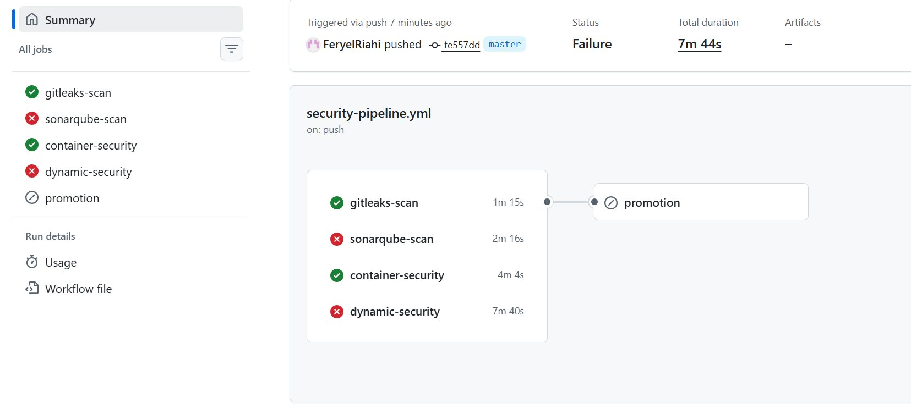
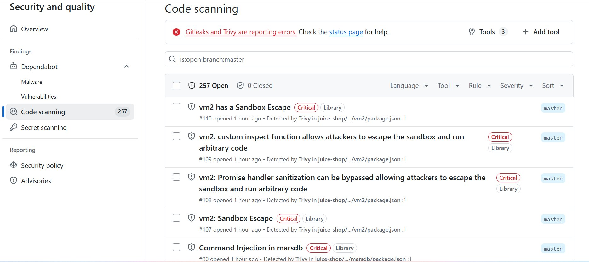
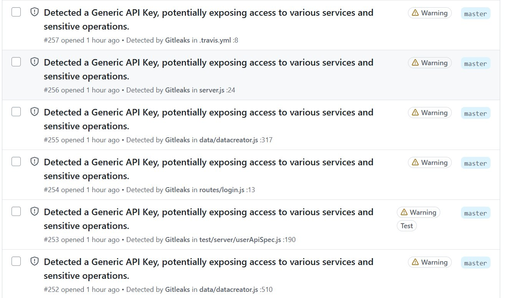
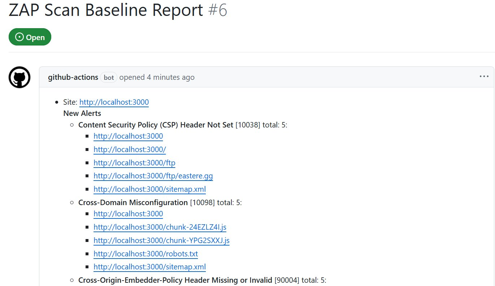
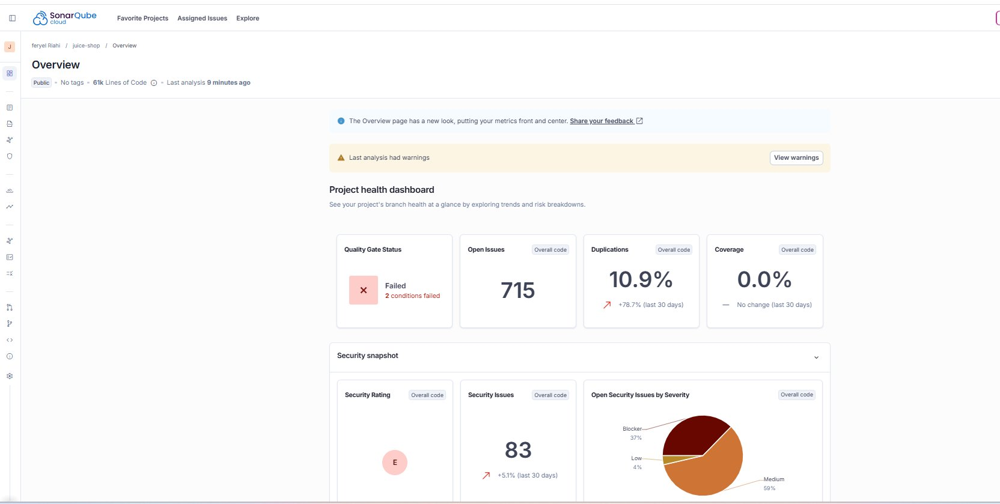

# 🛡️ DevSecOps Security Automation Pipeline

  

---

## 📌 Overview

This project implements an automated **DevSecOps pipeline** that integrates multiple security scanning stages into CI/CD using **GitHub Actions**.

It detects:
- 🔑 Secrets and credentials exposed in code
- 📦 Vulnerable dependencies and container image CVEs
- 🧠 Insecure code patterns via static analysis
- 🌐 Runtime web vulnerabilities via dynamic testing

And **blocks unsafe builds** based on defined security thresholds — ensuring only verified, secure code reaches deployment.

> **Note:** This pipeline runs against [OWASP Juice Shop](https://github.com/juice-shop/juice-shop), a deliberately vulnerable Node.js application used as a realistic scanning target. The focus of this project is the **pipeline architecture and security automation**, not the application code itself.

---

## 🧱 Architecture

```
Git Push
   ↓
GitHub Actions Pipeline
   ↓
┌─────────────────────────────────────┐
│  1. Gitleaks   → Secrets Detection  │
│  2. Trivy      → Dependency & Image │
│  3. SonarQube  → Static Analysis    │
│  4. OWASP ZAP  → Dynamic Testing    │
└─────────────────────────────────────┘
   ↓
Security Gates (fail on HIGH / CRITICAL)
   ↓
Docker Build (only if all gates pass)
```

---

## 🔧 Tools Used

| Tool | Purpose | Category |
|------|---------|----------|
| **GitHub Actions** | CI/CD automation & orchestration | Pipeline |
| **Gitleaks** | Secret & credential detection | Secrets Scanning |
| **Trivy** | Dependency & container vulnerability scanning | SCA |
| **SonarQube / SonarCloud** | Static code analysis & code smells | SAST |
| **OWASP ZAP** | Dynamic application security testing | DAST |
| **Docker** | Application containerization | Runtime |

---

## 🚦 Security Policy

The pipeline enforces risk-based gates before any build is allowed to proceed:

| Severity | Action |
|----------|--------|
| 🔴 CRITICAL | ❌ Pipeline fails immediately |
| 🟠 HIGH | ❌ Pipeline fails immediately |
| 🟡 MEDIUM | ⚠️ Reported, does not block build |
| 🟢 LOW | ⚠️ Reported, does not block build |
| 🔐 Any Secret Found | ❌ Always blocks build, no exceptions |

---

## 🔄 Pipeline Flow

### 1. 🔐 Secrets Scan — Gitleaks
Scans every commit for exposed credentials, API keys, tokens, or passwords before anything else runs.  
**If a secret is found → build stops immediately.**

### 2. 📦 Dependency Scan — Trivy
Scans project dependencies and Docker image layers for known CVEs from public vulnerability databases.  
**CRITICAL/HIGH CVEs → build fails.**

### 3. 🧠 Static Analysis — SonarQube
Analyzes source code for insecure patterns, code smells, and security hotspots without running the application.  
Findings are published to the **SonarCloud dashboard**.

### 4. 🌐 Dynamic Testing — OWASP ZAP
Spins up the running application and simulates real-world attacks (XSS, injection, misconfigurations, etc.).  
Reports are automatically posted as **GitHub Issues**.

### 5. 🐳 Docker Build (Promotion)
Only executes if **all four security stages pass**. This is the final enforcement gate.

---

## 📊 Output & Reporting

Security findings surface in three places:

- **GitHub Security tab** — Gitleaks and Trivy alerts (SARIF format)
- **GitHub Issues** — OWASP ZAP reports auto-created per run
- **SonarCloud Dashboard** — Code quality metrics, vulnerabilities, and hotspots

---

## 📸 Screenshots

### ① GitHub Actions — Pipeline Run

The pipeline triggered on a push to `master`. Gitleaks and container-security passed ✅. SonarQube and dynamic-security flagged violations ❌, causing the promotion (Docker build) stage to be skipped — exactly as intended by the security gate policy.



---

### ② GitHub Security Tab — Trivy: Critical CVEs Detected

Trivy reported **257 open code scanning alerts**, including multiple **Critical**-severity sandbox escape vulnerabilities in the `vm2` library and command injection in `marsdb` — all detected automatically and surfaced directly in the GitHub Security tab.



---

### ③ GitHub Security Tab — Gitleaks: Secret Detection

Gitleaks detected **generic API keys** exposed across multiple source files including `.travis.yml`, `server.js`, `routes/login.js`, and test files — all flagged as warnings and reported to the Security tab without any manual intervention.



---

### ④ OWASP ZAP — GitHub Issue Auto-Report

ZAP automatically opened a GitHub Issue (#6) with a full baseline scan report against the running application. Findings include missing **Content Security Policy headers**, **Cross-Domain Misconfiguration**, and **Cross-Origin-Embedder-Policy** violations across multiple routes.



---

### ⑤ SonarCloud — Project Dashboard

SonarCloud shows the Quality Gate as **Failed** (2 conditions failed) on the `juice-shop` project. The analysis surfaced **715 open issues**, a **Security Rating of E**, **83 security issues**, and **10.9% code duplication** — giving a full picture of code health beyond just vulnerabilities.



---

## 🎯 Goal of This Project

To demonstrate a production-style DevSecOps CI/CD pipeline that:

- **Shifts security left** — catches vulnerabilities before they reach deployment
- **Automates vulnerability detection** — no manual scanning required
- **Enforces security gates** — builds cannot pass without meeting security thresholds
- **Integrates multiple security layers** — secrets, SCA, SAST, and DAST in one unified workflow

---

## 🧠 Key Concepts Demonstrated

- CI/CD security integration with GitHub Actions
- Shift-left security approach in software development
- SAST / DAST / SCA pipeline design
- Risk-based vulnerability handling and enforcement
- Automated security gate policies
